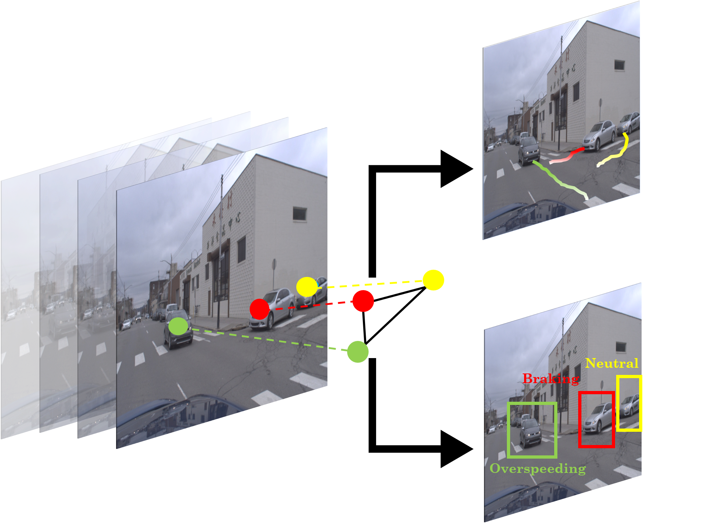
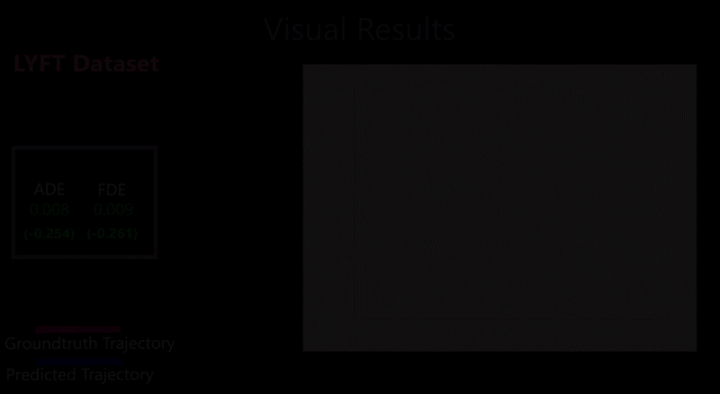
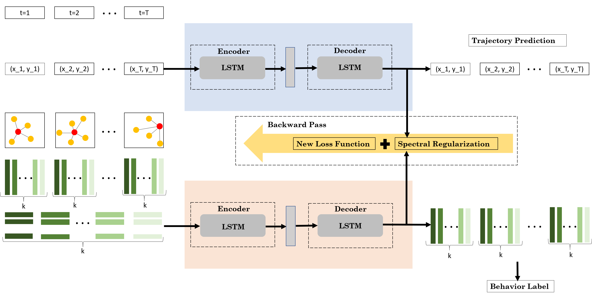
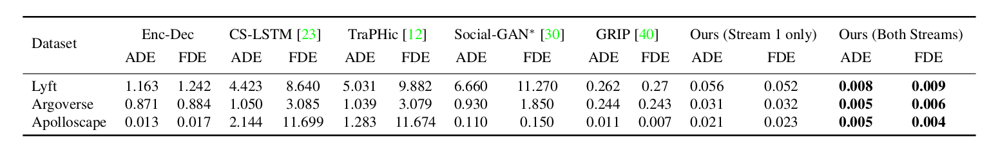
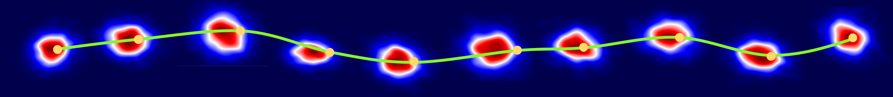
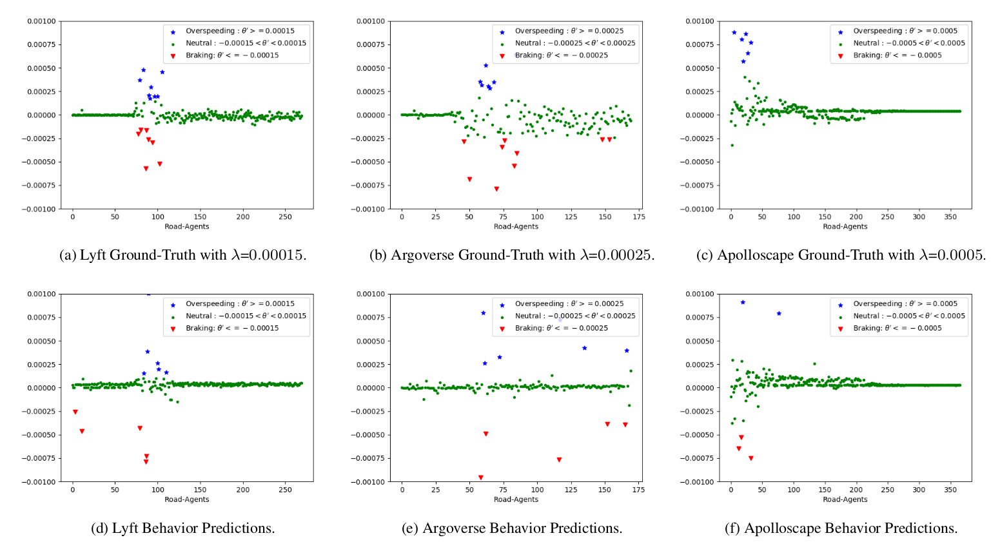

[](https://paperswithcode.com/sota/trajectory-prediction-on-apolloscape?p=forecasting-trajectory-and-behavior-of-road-1) [](https://paperswithcode.com/sota/trajectory-prediction-on-argoverse?p=forecasting-trajectory-and-behavior-of-road-1)[](https://paperswithcode.com/sota/trajectory-prediction-on-lyft-level-5?p=forecasting-trajectory-and-behavior-of-road-1)
<br>


### Paper - [**Forecasting Trajectory and Behavior of Road-Agents Using Spectral Clustering in Graph-LSTMs**](https://obj.umiacs.umd.edu/gamma-umd-website-imgs/pdfs/autonomousdriving/spectralcows_full.pdf)

Project Page - https://gamma.umd.edu/spectralcows

Please cite our work if you found it useful.

```
@article{chandra2019forecasting,
  title={Forecasting Trajectory and Behavior of Road-Agents Using Spectral Clustering in Graph-LSTMs},
  author={Chandra, Rohan and Guan, Tianrui and Panuganti, Srujan and Mittal, Trisha and Bhattacharya, Uttaran and Bera, Aniket and Manocha, Dinesh},
  journal={arXiv preprint arXiv:1912.01118},
  year={2019}
}
```

<p align="center">



</p>

Since this is a research codebase and maintained by students, this repo is under active maintenance. Do let us know of any issues you may encounter and we will do our best to resolve them :) A list of known bugs with solutions is regularly maintained and compiled [**here**](https://github.com/rohanchandra30/Spectral-Trajectory-Prediction/wiki/Known-bugs), and optimizations/enhancements to the code
are compiled [**here**](https://github.com/rohanchandra30/Spectral-Trajectory-and-Behavior-Prediction/wiki/Enhancements).
## Instruction

Python version: 3.7

### Installation

1. Create a conda environement<br>
  `conda env create -f env.yml`

2. To activate the environment:<br>
  `conda activate sc-glstm`

3. Download resources <br>
  `python setup.py`

### Usage

* To run our one & two stream model:<br>
  1. `cd ours/`<br>
  2. `python main.py`
  3. To change between one stream to two stream, simply change the variable `s1` in main.py between True and False.
  4. To change the model, change `DATA` and `SUFIX` variable in main.py.
* To run EncDec comparison methods:<br>
  1. `cd comparison_methods/EncDec/`<br>
  2. `python main.py`
  3. To change the model, change `DATA` and `SUFIX` variable in main.py.
* To run GRIP comparison methods:<br>
  1. `cd comparison_methods/GRIP/`<br>
  2. `python main.py`
  3. To change the model, change `DATA` and `SUFIX` variable in main.py.
* To run TraPHic/SC-LSTM comparison methods:<br>
  1. `cd comparison_methods/traphic_sconv/`
  2. `python main.py`
  3. To change the model and methods, change `DATASET` and `PREDALGO` variable in main.py.

Note: During evaluation of the trained_models, the best results may be different from reported error due to different batch normalization applied to the network. To obtain the same number, we may have to mannually change the network.

### List of Trajectory Prediction Methods Implemented

Please cite the methods below if you use them.

* [**TraPHic: Trajectory Prediction in Dense and Heterogeneous Traffic Using Weighted Interactions**, CVPR'19](https://gamma.umd.edu/researchdirections/autonomousdriving/traphic/)<br>
Rohan Chandra, Uttaran Bhattacharya, Aniket Bera, Dinesh Manocha.
* [**Convolutional Social Pooling for Vehicle Trajectory Prediction**, CVPRW'18](https://arxiv.org/pdf/1805.06771.pdf)<br>
Nachiket Deo and Mohan M. Trivedi.
* [**Social GAN: Socially Acceptable Trajectories with Generative Adversarial Networks**, CVPR'18](https://arxiv.org/pdf/1803.10892.pdf)<br>
Agrim Gupta, Justin Johnson, Fei-Fei Li, Silvio Savarese, Alexandre Alahi.
* [**GRIP: Graph-based Interaction-aware Trajectory Prediction**, ITSC'19](https://arxiv.org/pdf/1907.07792.pdf)<br>
Xin Li, Xiaowen Ying, Mooi Choo Chuah 

As the official implementation of the GRIP method is not available, the code provided here is our own effort to replicate the GRIP method to the best of our ability and does not necessarily convey the original implementation of the authors. Please contact the authors directly for the original implementation. 

#### Pull Requests and Contributions
Additionally, the graph construction part of GRIP may be slow as the code does not exploit optimized data structures and algorithms. If anyone uses the GRIP code and can come up with an optimized way to reduce computational time, please consider creating a pull request and we will acknoledge your contributions here ! :)

### Datasets
* [**Argoverse**](https://www.argoverse.org/data.html)
* [**Apolloscape**](http://apolloscape.auto/trajectory.html)
* [**Lyft Level 5**](https://level5.lyft.com/dataset/)


### Resources folder structure
* data -- input and output of stream 1 & 2 (This is directly avaiable in resources folder)
* raw_data -- location of the raw data (put the downloaded dataset in this folder to process)
* trained_model -- some saved models


### Data preparation steps
Important steps if you plan to prepare the data from the raw data

#### Formatting the dataset after downloading from the official website
* Run `data_processing/format_apolloscape.py` to format the downloaded apolloscape data into our desired representation
* Run `data_processing/format_lyft.py` to format the downloaded lyft data into our desired representation
* Run `data_processing/generate_data.py` to format the downloaded Argoverse trajectory data into our desired representation

#### For preparing the formatted data into the data structures which our model requires
* Use `data_processing/data_stream.py` to generate input data for stream1 and stream2. 
* Use `generate_adjacency()` function in `data_processing/behaviors.py` to generate adjacency matrices.
* Must use `add_behaviors_stream2()` function in `data_processing/behaviors.py` to add behavior labels to the stream2 data before supplying the data to the network.

### Plotting

* use the `plot_behaviors()` function in `data_processing/behaviors.py` to plot the behaviors of the agents.

## Our network

<p align="center">

</p>

## Comparison with other models


## Results

### Trajectory Prediction Result


### Behavior prediction results
<p align="center">
  
</p>


